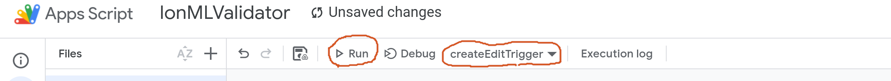

# 📋 Инструкция по использованию скрипта валидации в Google Таблицах

Этот скрипт автоматически проверяет структуру данных в Google Таблицах по заданной схеме. Он подсвечивает ошибки в оформлении заголовков и подзаголовков, а также генерирует подробный отчёт о соответствии.

---

## 🚀 Быстрый старт

### 1. Откройте Google Таблицу
Откройте нужную таблицу в Google Sheets. Нам понадобиться `SPREADSHEET_ID` который можно извлечь из URL.

```
https://docs.google.com/spreadsheets/d/SPREADSHEET_ID/edit?gid=0#gid=0
```


### 2. Перейдите в редактор скриптов (script.google.com)

Создайте новый проект и назовите его. **Важно**: мы создаем скрипт отдельно (**standalone**) и потом свяжем его через триггеры с нужной нам таблицей. Если создать скрипт через таблицу (bounded), то все редакторы таблицы получат доступ к коду и смогут внести произвольные правки, которые будут исполняться **всеми пользователями таблицы**. В **standalone** скрипте, код не будет доступен пользователям таблицы.

Откроется редактор Google Apps Script. Создаться файл с кодом, с расширением `.gs`. В проекте может быть несколько файлов - все валидации можно держать в одном проекте в разных файлах.

### 3. Вставьте код

Удалите всё, что создалось в редакторе автоматически, и вставьте **весь код из файла Validator.gs**. Замените строку `SPREADSHEET_ID` на идентификатор извлеченных из URL на первом шаге.

```javascript
const SPREADSHEET_ID = "SPREADSHEET_ID"
```

> 💡 Убедитесь, что вы вставляете **всё целиком**, включая комментарии и константы.

### 4. Настройте разрешённые листы (ОБЯЗАТЕЛЬНО!)

Найдите в коде строку и добавьте листы, которые не нужно проверять. Так как могут добавляться пользователи таблицы и для каждого будет создан свой лист, такой способ мы считаем более удобным, чем каждый раз менять скрипт добавляя разрешенные листы.

```js
const SKIP_SHEETS = ["Contributors"]; 
```

### 5. Сохраните проект
Нажмите **Ctrl + S** или значок 💾 (Сохранить) в редакторе Apps Script.  
Дайте проекту понятное имя, например: `Валидатор структуры данных`.

> 💡 После сохранения убедитесь, что в левом верхнем углу отображается имя вашего проекта — это означает, что сохранение прошло успешно.

---

### 6. Авторизуйте триггеры (!ОДИН РАЗ!)

У нас есть проверочный скрипт и теперь нужно добавить связь с таблицей, т.е. чтобы скрипт запускался только по изменению определнной таблицы. Для этого используются **installable triggers**. Простые триггеры (`onEdit(e)` или `onChange(e)`) в данном случае на сработают так как работают только для bounded скриптов, которые мы считаем небезопасными. Выберите `createEditTrigger` и нажмите `Run` Google запросит разрешения на доступ к вашей таблице - разрешите доступ. Повторите для `createChangeTrigger`.



Если по ошибке было запущено несколько раз, дубликаты можно удалить на вкладке с триггерами в меню слева (с иконкой часов ⏰). 

#### Как запустить вручную для авторизации:
1. В редакторе скриптов в выпадающем списке функций выберите `validateAllBlocks`.
2. Нажмите кнопку **▶️ Выполнить**.
3. Появится окно с запросом разрешений — нажмите **«Обзор разрешений»** → выберите аккаунт → **«Разрешить»**.

> 🔐 Скрипт запрашивает доступ только к текущей таблице — это безопасно.  
> ❗ Без авторизации автоматическая валидация работать **не будет**.

---

## ✅ Как работает валидация

Скрипт проверяет **каждую пару строк**:  
- **Нечётная строка** — ожидается заголовок (`DOI`, `Year`, `InputData` и т.д.)  
- **Следующая (чётная) строка** — ожидается подзаголовок с подпунктами и основными данными (`Name: ...`, `Type: ...` и т.д.)

Проверка запускается:
- Автоматически при редактировании (триггер `onEdit`)
- При вставке строк/листов (триггер `onChange`)
- Вручную через функцию `validateAllBlocks`

---

# 🔧 Нюансы в коде: API, регулярные выражения и ограничения

Скрипт не требует внешних сервисов и полностью автономен, но имеет ряд технических особенностей, о которых важно знать — особенно если вы планируете его дорабатывать или сталкиваетесь с неожиданным поведением.

---

## 1. Использование API Google Sheets

Скрипт взаимодействует с таблицей через официальные методы Google Sheets API, доступные в Apps Script. Это включает:

- Чтение и запись значений ячеек.
- Установку цвета фона и форматирование (жирный текст, выравнивание).
- Автоматическую подстройку высоты строк под содержимое.

**Важно:** Google накладывает ограничения на количество операций и время выполнения скрипта. Например:

- Максимальное время выполнения — 6 минут.
- Ограничение на количество вызовов к API в сутки (особенно при массовой валидации).
- При работе с очень большими таблицами (>100 пар строк) возможны задержки.

---

## 2. Регулярные выражения — как они работают

Скрипт активно использует регулярные выражения для:

- Проверки формата дат в поле `DatasetTimeSpan`.
- Гибкого поиска подпунктов (например, `Name:`, `name :`, `NAME:` — всё допустимо).

### Формат дат

Ожидается строгий формат: `ГГГГ.ММ.ДД–ГГГГ.ММ.ДД`  
Пример: `2020.01.01–2020.12.31`

**Ключевой нюанс:** между датами должно стоять **длинное тире `–`** (Unicode U+2013), а не обычный дефис `-`. Это частая причина ошибок — пользователи копируют данные с дефисом, и валидация не проходит.

Если в ваших данных используется другой формат — его можно изменить в настройках скрипта, заменив шаблон поиска.

### Поиск подпунктов

Скрипт игнорирует регистр и допускает пробелы вокруг двоеточия. Например:

- `Name: значение`
- `name : значение`
- `NAME:значение`

— все варианты будут распознаны корректно.

Подпункты должны быть разделены **запятой** или **точкой с запятой**. Другие разделители (например, `|` или `/`) не поддерживаются без изменения кода.

---

## 3. Нормализация текста

Перед проверкой все значения ячеек автоматически:

- Преобразуются в строки.
- Обрезаются от лишних пробелов по краям.
- Заменяются пустые или `null`-значения на пустую строку.

Это снижает количество ложных ошибок из-за форматирования или неявных типов данных.

---

## 4. Логика проверки подпунктов

Скрипт не требует строгого порядка подпунктов — важно только их наличие. Например, если в `SUBPOINTS` указано, что для `InputData` нужны `Name:`, `Type:` и `InputFeatures:`, то они могут идти в любом порядке в ячейке — скрипт всё равно найдёт их.

**Однако:** если хотя бы один обязательный подпункт отсутствует — поле помечается как ошибочное.

---

## 5. Архитектурные ограничения

- **Пары строк**: скрипт всегда проверяет нечётную строку и следующую за ней чётную. Если у вас нечётное количество строк или данные начинаются со второй строки — валидация может работать некорректно.
- **Только столбцы A–N**: скрипт игнорирует всё, что правее 14-го столбца.
- **Столбец O зарезервирован**: в него записываются результаты проверки. Не храните там важные данные — они будут перезаписаны.
- **Объединённые ячейки**: могут нарушить работу скрипта, особенно при чтении диапазонов. Рекомендуется избегать объединения в зоне A–O.
- **Форматирование**: скрипт сбрасывает часть форматирования (например, курсив или размер шрифта) при записи отчёта — сохраняются только цвет фона, жирность и выравнивание.


## 6. Безопасность

- Скрипт **не отправляет** ваши данные во внешние сервисы. 
- Не использует интернет-запросы, API третьих сторон или облачные функции.
- Запрашивает только разрешение на доступ к текущей таблице — ничего больше.
- Код полностью прозрачен — вы можете просмотреть его перед запуском.
- Вы можете провести быстрый аудит скрпита через любую LLM.
💡 Скрипт работает через ваш аккаунт (тригерры установлены через ваш аккаунт), поэтому расходует лимиты на работу скриптов, которые запускаются в "песочнице" на серверах Google. На момент написания срипта лимит был равен 90 минут в сутки, а один запуск занимал 6 секунд. Т.е. можно запускать до 900 проверок в сутки. 

---

## ✅ Советы для адаптации

- Если меняете структуру таблицы — обязательно обновите и `SCHEMA_FIELDS`, и `SUBPOINTS` вместе.
- Перед изменением регулярных выражений протестируйте их на специализированных сайтах (например, [regex101.com](https://regex101.com)).
- Для отладки можно добавить вывод в консоль через `console.log()` — результаты будут видны во вкладке «Выполнения» в редакторе скриптов.

---
